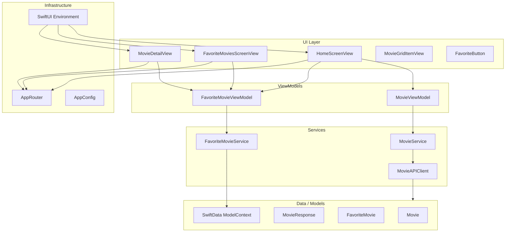
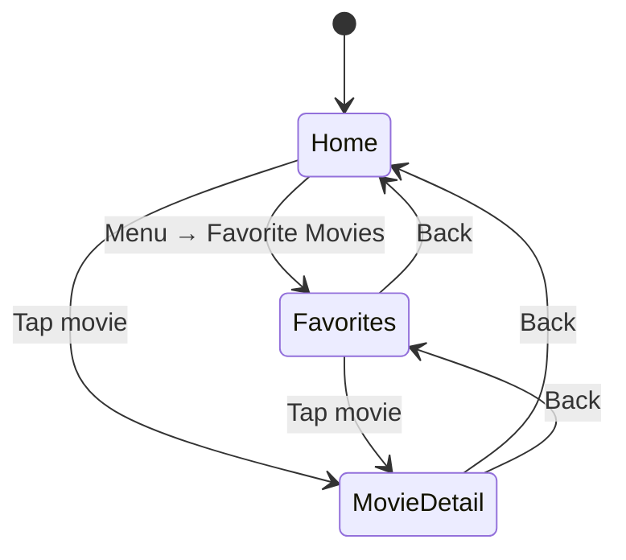
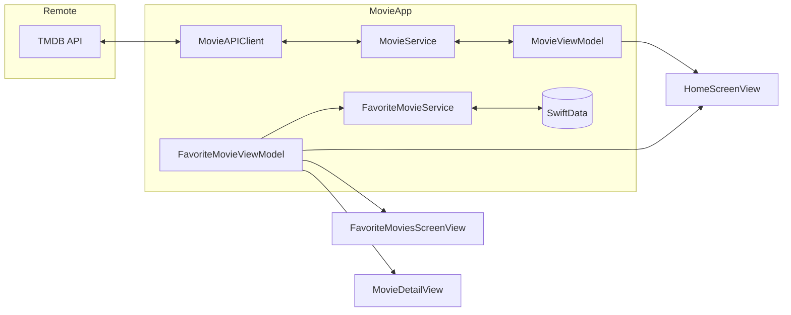
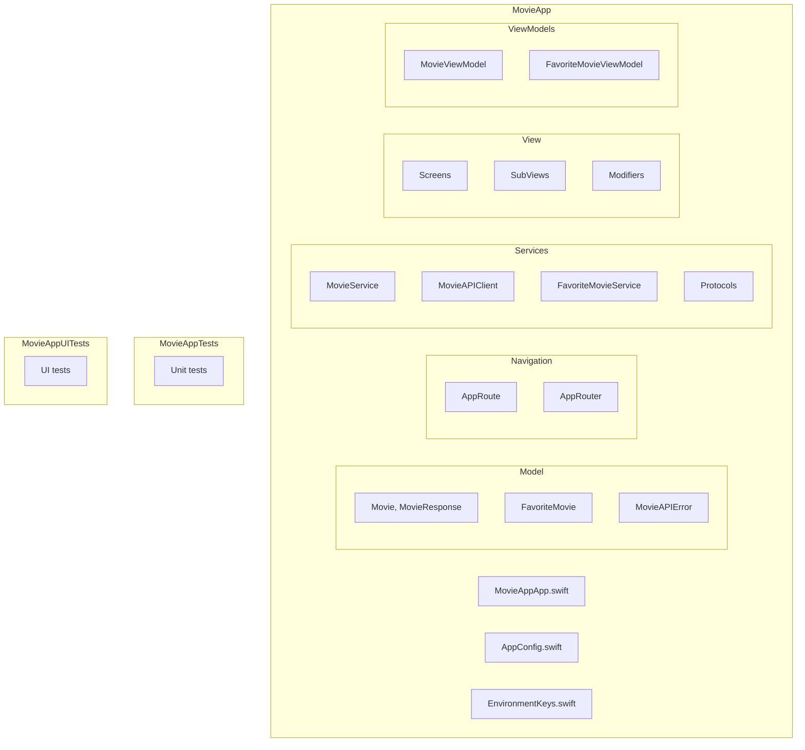

# MovieApp

A small iOS app demo for browsing now-playing movies and managing favorites (SwiftUI + SwiftData).

---

## Architecture

- **Stack:** SwiftUI, SwiftData, async/await. Networking with `URLSession`; API key via environment or Info.plist.
- **Pattern:** MVVM. Views observe ViewModels; services (MovieService, FavoriteMovieService) are behind protocols for testability.
- **Navigation:** Single `AppRouter` (ObservableObject) holds the navigation path. One `NavigationStack(path:)` and one `.navigationDestination(for: AppRoute.self)` at the root; screens call `router.push(.favorites)` or `router.push(.movieDetail(movie))` instead of owning navigation state.
- **Dependencies:** `MovieService` and `FavoriteMovieViewModel` are created in the root and injected via SwiftUI Environment so tests can inject mocks.
- **At scale:** Next step would be grouping by feature (e.g. Features/Home, Features/Favorites) and/or a dedicated module for shared models and services.

### High-level layers



### Navigation flow



```mermaid
flowchart LR
    subgraph Routes["AppRoute"]
        R1[.home]
        R2[.favorites]
        R3[.movieDetail(Movie)]
    end

    subgraph Screens["Screens"]
        S1[HomeScreenView]
        S2[FavoriteMoviesScreenView]
        S3[MovieDetailView]
    end

    R1 --> S1
    R2 --> S2
    R3 --> S3

    RootView["RootView\nNavigationStack(path: $router.path)"] --> R1
    RootView --> R2
    RootView --> R3
```

### Data flow



### Dependency injection (root)

```mermaid
flowchart TB
    App[MovieAppApp]
    App --> URLCache
    App --> ModelContainer[ModelContainer\nSwiftData]
    App --> RootView[RootView]

    RootView --> Router[AppRouter\n@StateObject]
    RootView --> FavVM[FavoriteMovieViewModel\n@StateObject]
    RootView --> MovieService[MovieService\nfrom Environment]

    RootView --> Env[.environment]
    Env --> movieService
    Env --> appRouter
    Env --> favoriteMovieViewModel
    Env --> .modelContainer

    HomeScreenView[HomeScreenView] -.-> movieService
    HomeScreenView -.-> appRouter
    HomeScreenView -.-> favoriteMovieViewModel
    FavoriteMoviesScreenView -.-> appRouter
    FavoriteMoviesScreenView -.-> favoriteMovieViewModel
    MovieDetailView -.-> appRouter
    MovieDetailView -.-> favoriteMovieViewModel
```

### Project structure



## Setup

To run the app, set your [TMDB](https://www.themoviedb.org/) API key:

- **Xcode:** Edit Scheme → Run → Arguments → Environment Variables → add `TMDB_API_KEY` = your key.
- Or add `TMDB_API_KEY` to the app’s Info.plist (do not commit the key to the repo).


